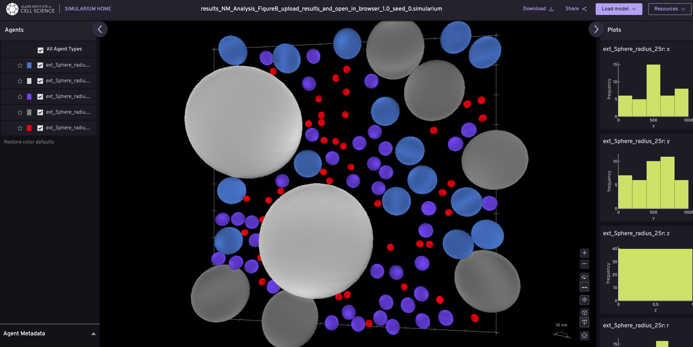

# cellPACK

[](https://github.com/mesoscope/cellpack/actions/workflows/ci.yml)
[](https://mesoscope.github.io/cellpack/)
[](https://codecov.io/gh/mesoscope/cellpack)

An algorithm to pack molecular recipes

**Try cellPACK online:** [cellpack.allencell.org](https://cellpack.allencell.org)

## Installation

> [!NOTE]
> These are the basic installation steps. However, our recommendation for developers is to install using `uv`. See advanced installation instructions [here](./docs/INSTALLATION.md).

1. Install Python 3.11 and `git`.  Update pip at least to `24.0.0`.
2. Clone this git repository.
```bash
git clone git@github.com:mesoscope/cellpack.git
cd cellpack
```
1. Create a new virtual environment and activate it.
```bash
python -m venv .venv
source .venv/bin/activate
```
1. Install the required packages for your operating system. Replace `linux` with `macos` or `windows` as appropriate.
```bash
pip install --upgrade pip
pip install -r requirements/linux/requirements.txt
pip install -e .
```

## Pack example recipes

cellPACK supports two recipe formats: **v1** (legacy) from the original publication, and **v2** (modern) with improved structure. We recommend starting with **v2** for new recipes.

### Recipe Format Versions

#### v1 Recipes (Legacy Format)
**v1 recipes** use the original schema from the [Nature Methods publication](https://www.nature.com/articles/nmeth.3204). These recipes feature:
- Explicit parameter definitions for all ingredients
- Backward compatibility with the original cellPACK publication examples

**Example v1 recipes:**
- `NM_Analysis_FigureB1.0.json` - Blood plasma mesoscale model from the Nature Methods publication
- `BloodPlasma_noHIV_1.0_2D.json` - 2D blood plasma model
- `partner_packing.json` - Example of molecular partner binding

**Run a v1 recipe:**
```bash
pack -r examples/recipes/v1/NM_Analysis_FigureB1.0.json
```



#### v2 Recipes (Modern Format)
**v2 recipes** use a modernized schema with improved structure and features:
- Cleaner organization with `objects` and `composition` sections
- Object inheritance system for efficient recipe authoring
- Better support for complex cellular environments

**Example v2 recipes:**
- `spheres_in_a_box.json` - Simple 3D multi-sphere packing (great for getting started)
- `peroxisome.json` - Peroxisome organelle model
- `er_peroxisome.json` - Endoplasmic reticulum with peroxisomes
- `vector_gradient.json` - Demonstrates gradient-based ingredient distributions
- `partner_packing.json` - Molecular partner interactions

**Run a v2 recipe:**
```bash
pack -r examples/recipes/v2/spheres_in_a_box.json
```


### Remote Recipe Loading
You can also load recipes directly from remote servers:
```bash
pack -r github:recipes/NM_Analysis_FigureB1.0.json
```

### Config Files
Config files control packing behavior and simulation parameters including:
- **Place methods** - Algorithm used for ingredient placement (e.g., `jitter`, `spheresSST`)
- **Output formats** - Save options for results and analysis
- **Grid settings** - Spatial grid parameters for collision detection
- **Debugging options** - Visualization and diagnostic tools

**Using a config file:**
```bash
pack -r examples/recipes/v2/spheres_in_a_box.json -c examples/packing-configs/debug.json
```

**Stable Release:** `pip install cellpack`<br>
**Development Head:** `pip install git+https://github.com/mesoscope/cellpack.git`

## Documentation

For full package documentation please visit [mesoscope.github.io/cellpack](https://mesoscope.github.io/cellpack).

## Development

See [CONTRIBUTING.md](./docs/CONTRIBUTING.md) for information related to developing the code.

## Remote databases
cellPACK uses AWS and Firebase Firestore as remote databases to store packing results and recipes. Follow [ setup instructions](./docs/REMOTE_DATABASES.md) for access.

## Docker
cellPACK can be run in Docker containers for both AWS ECS and AWS Batch. Follow the [instructions](./docs/DOCKER.md) to set up the Docker environment.

**MIT license**