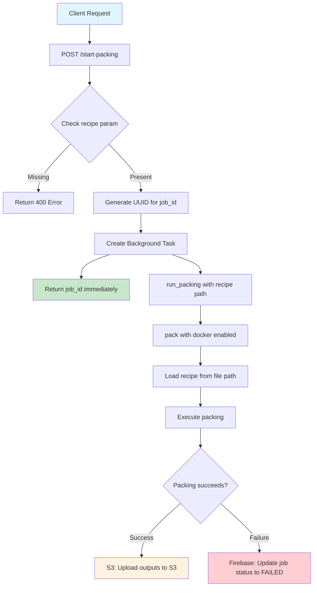
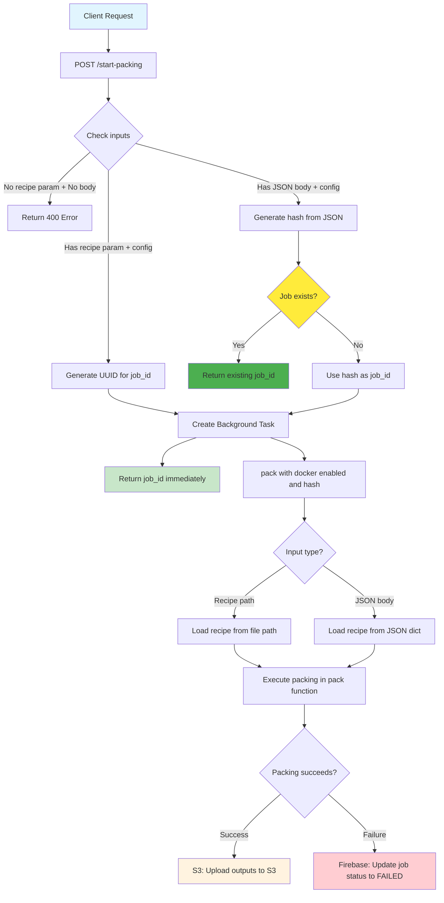

# CellPACK Server Job Workflow Changes

## Summary of Changes

The main changes in this PR allow the server to accept recipe JSON directly in the request body, in addition to the existing recipe file path approach. This enables better deduplication and caching of packing jobs.

## BEFORE: Original Server Workflow

## AFTER: Enhanced Server Workflow with JSON Recipe Support

## Key Server Improvements

### 1. **Deduplication & Caching**
- **BEFORE**: Each request generated a unique UUID, no deduplication possible
- **AFTER**: JSON recipes generate deterministic hash, enabling job deduplication

### 2. **Input Flexibility**
- **BEFORE**: Only recipe file paths supported via query parameter
- **AFTER**: Supports both recipe file paths AND direct JSON recipe objects in request body, plus optional config parameter

### 3. **Job Tracking**
- **BEFORE**: Generated UUID for each job without deduplication
- **AFTER**: Uses deterministic hash for JSON recipes, enabling job reuse

### 4. **Smart Job Management**
- **BEFORE**: Every request creates new job regardless of content
- **AFTER**: Identical recipe JSON returns existing job ID if already processed

## Technical Implementation

### New Server Components:
1. **`DataDoc.generate_hash()`** - Creates deterministic hash from recipe JSON
2. **`job_exists()`** - Checks if job already completed in Firebase
3. **Enhanced request handling** - Reads JSON from request body
4. **Smart job ID generation** - Uses hash for JSON recipes, UUID for file paths

### Note: Known Issues
- Error message still says "recipe as a query param" but should mention body JSON is also accepted

### Request Flow Changes:
1. **Input validation** now checks both query params and request body
2. **Hash-based deduplication** for JSON recipes
3. **Backward compatibility** maintained for file-based recipes
4. **Consistent job tracking** with hash parameter

## Benefits

1. **Reduced Server Load**: Identical recipes don't reprocess
2. **Faster Client Response**: Instant return for duplicate JSON requests  
3. **Better Resource Utilization**: No redundant compute for same recipes
4. **Improved API Design**: JSON recipes easier for programmatic access